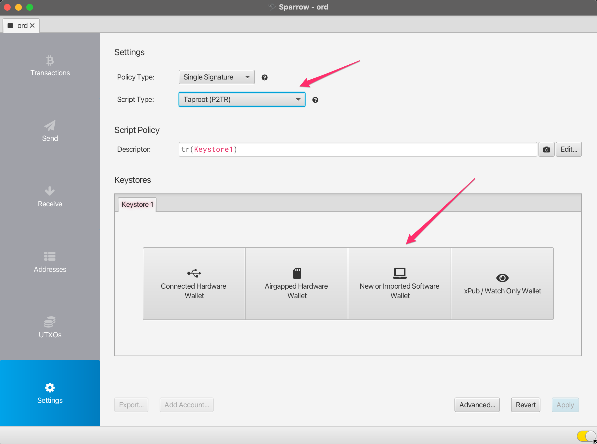
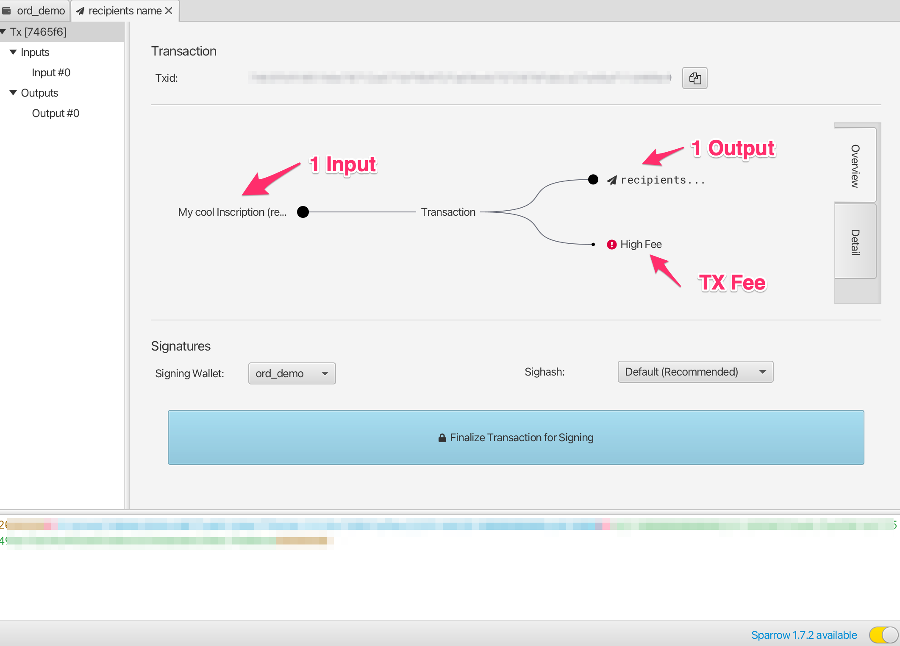

Recoger Inscripciones y Ordinales con Sparrow Wallet
=====================

Los usuarios que no pueden o aún no han configurado la cartera [ord](https://github.com/ordinals/ord) pueden recibir inscripciones y ordinales con carteras bitcoin alternativas, siempre y cuando sean muy cuidadosos sobre cómo gastan desde esa cartera.

Esta guía proporciona algunos pasos básicos sobre cómo crear una cartera con [Sparrow Wallet](https://sparrowwallet.com/) que es compatible con `ord` y puede ser posteriormente importada en `ord`.

## ⚠️⚠️ ¡¡Atención!! ⚠️⚠️
Como regla general, si eliges este enfoque, deberías usar esta cartera con el software Sparrow solamente como una cartera de recepción.

No gastes satoshis de esta cartera a menos que estés seguro de lo que estás haciendo. Podrías perder fácilmente el acceso a tus ordinales e inscripciones si no haces caso a esta advertencia.

## Configuración de la Cartera & Recepción

Descarga Sparrow Wallet desde la [página de lanzamiento](https://sparrowwallet.com/download/) para tu sistema operativo.

Selecciona `File -> New Wallet` y crea una nueva cartera llamada `ord`.

Cambia el `Script Type` a `Taproot (P2TR)` y selecciona la opción `New or Imported Software Wallet`.

Selecciona `Use 12 Words` y luego haz clic en `Generate New`. Deja la contraseña en blanco.

Se generará para ti una nueva frase secreta BIP39 de 12 palabras. Anota esta frase en un lugar seguro ya que es tu respaldo para acceder a tu cartera. NUNCA compartas o muestres esta frase secreta a nadie.

Una vez que hayas anotado la frase secreta, haz clic en `Confirm Backup`.

Reintroduce la frase secreta que anotaste, y luego haz clic en `Create Keystore`.

Haz clic en `Import Keystore`.

Haz clic en `Apply`. Si lo deseas, puedes agregar una contraseña para la cartera.

Ahora tienes una cartera que es compatible con `ord`, y puede ser importada en `ord` usando la frase secreta BIP39. Para recibir ordinales o inscripciones, haz clic en `Receive` y copia una nueva dirección.

Cada vez que quieras recibir, debes usar una dirección completamente nueva, y no reutilizar direcciones existentes.

Nota que el bitcoin es diferente de algunas otras carteras blockchain, ya que esta cartera puede generar un número ilimitado de nuevas direcciones. Puedes generar una nueva dirección haciendo clic en `Get Next Address`. Puedes ver todas tus direcciones en la pestaña `Addresses` de la app.

Puedes agregar una etiqueta a cada dirección, para poder rastrear para qué fue usada.

## Validación / Visualización de las Inscripciones Recibidas

Una vez que hayas recibido una inscripción, verás una nueva transacción en la pestaña `Transactions` de Sparrow, así como un nuevo UTXO en la pestaña `UTXOs`.

Inicialmente, esta transacción podría tener un estado de "No confirmado", y tendrás que esperar a que sea minada en un bloque de bitcoin antes de que esté completamente recibida.

Para monitorear el estado de tu transacción, puedes hacer clic derecho sobre ella, seleccionar `Copy Transaction ID` y luego pegar ese ID de transacción en [mempool.space](https://mempool.space).

Una vez que la transacción ha sido confirmada, puedes validar y ver tu inscripción yendo a la pestaña `UTXOs`, encontrando el UTXO que quieres verificar, haciendo clic derecho en `Output` y seleccionando `Copy Transaction Output`. Este ID de salida de la transacción puede ser pegado en la búsqueda de [ordinals.com](https://ordinals.com) search.

## Congelación de UTXO
Como se explicó anteriormente, cada una de tus inscripciones se guarda en un Output de Transacción No Gastado (UTXO). Es muy importante ser cauteloso y no gastar accidentalmente tus inscripciones, y una forma de evitarlo es congelando el UTXO.

Para hacerlo, ve a la pestaña `UTXOs`, encuentra el UTXO que quieres congelar, haz clic derecho en `Output` y selecciona `Freeze UTXO`.

Este UTXO (Inscripción) ya no es gastable dentro de Sparrow Wallet hasta que lo descongeles.

## Importación al monedero `ord`

Para detalles sobre cómo configurar Bitcoin Core y el monedero `ord`, consulta la [Guía de Inscripciones](../inscriptions.md).

Cuando estés configurando `ord`, en lugar de ejecutar `ord wallet create` para crear un nuevo monedero, puedes importar tu monedero existente usando `ord wallet restore "BIP39 SEED PHRASE"` con la frase secreta generada con Sparrow Wallet.

Actualmente hay un [bug](https://github.com/ordinals/ord/issues/1589) que causa un problema en el monedero importado, impidiendo que escanee automáticamente contra la blockchain. Para solucionar este problema, debes iniciar manualmente un escaneo usando el cli de bitcoin core:
`bitcoin-cli -rpcwallet=ord rescanblockchain 767430`.

Después, puedes revisar las inscripciones de tu monedero usando `ord wallet inscriptions`.

Toma en cuenta que si previamente creaste un monedero con `ord`, ya tendrás un monedero con el nombre predeterminado, y tendrás que dar un nombre diferente a tu monedero importado. Puedes usar el parámetro `--wallet` en todos los comandos `ord` para referirte a un monedero diferente, por ejemplo:

`ord --wallet ord_from_sparrow wallet restore "BIP39 SEED PHRASE"`

`ord --wallet ord_from_sparrow wallet inscriptions`

`bitcoin-cli -rpcwallet=ord_from_sparrow rescanblockchain 767430`

## Envío de inscripciones con Sparrow Wallet

#### ⚠️⚠️ ¡Atención! ⚠️⚠️
Aunque se recomienda encarecidamente configurar un nodo bitcoin core y ejecutar el software `ord`, hay formas limitadas de enviar inscripciones desde Sparrow Wallet de manera segura. Ten en cuenta que esto no es recomendable, y solo deberías hacerlo si entiendes completamente lo que estás haciendo.

Usar el software `ord` eliminará mucha de la complejidad que describimos aquí, ya que puede manejar de manera automática y segura el envío de inscripciones de manera simple.

#### ⚠️⚠️ Advertencia Adicional ⚠️⚠️
No uses tu monedero de inscripciones Sparrow para realizar envíos generales de bitcoin no inscritos. Puedes configurar un monedero separado en Sparrow si necesitas realizar transacciones normales de bitcoin y mantener separado tu monedero de inscripciones.

#### El modelo UTXO de Bitcoin
Antes de enviar cualquier transacción, es crucial que tengas un buen entendimiento del sistema UTXO (Unspent Transaction Output) de Bitcoin. Bitcoin opera fundamentalmente diferente a muchas otras blockchains como Ethereum. En Ethereum, generalmente tienes una única dirección donde guardas el ETH, y no puedes diferenciar entre una cantidad de ETH y otra; simplemente es un valor total en esa dirección. Bitcoin funciona de manera muy diferente ya que generamos una nueva dirección en el monedero para cada recepción, y cada vez que recibes sats en una dirección de tu monedero, estás creando un nuevo UTXO. Cada UTXO puede ser visto y gestionado individualmente. Puedes seleccionar específicos UTXO que quieres gastar, y puedes elegir no gastar ciertos UTXO.

Algunos monederos Bitcoin no muestran este nivel de detalle, y solo te muestran un valor agregado de todos los bitcoins en tu monedero. Sin embargo, cuando envías inscripciones, es importante que uses un monedero como Sparrow que permite el control de UTXO.

#### Inspecciona tu inscripción antes de enviarla
Como mencionamos anteriormente, las inscripciones están grabadas en satoshis, y los satoshis están guardados dentro de los UTXO. Los UTXO son una colección de satoshis con un valor específico del número de satoshis (el valor de salida). Usualmente (pero no siempre), la inscripción estará grabada en el primer satoshi del UTXO.

Cuando inspecciones tu inscripción antes de enviarla, lo principal que querrás verificar es en qué satoshi del UTXO está grabada tu inscripción.

Para ello, puedes navegar a [Validando / Visualizando Inscripciones Recibidas](./sparrow-wallet.md#validating--viewing-received-inscriptions) como se describió anteriormente, encuentra la página de inscripción para tu inscripción en ordinals.com.

Allí encontrarás algunos metadatos sobre tu inscripción que se parecen al siguiente:

Hay algunas cosas importantes a verificar aquí:
* El identificador `output` coincide con el identificador del UTXO que estás a punto de enviar.
* El `offset` de la inscripción es `0` (esto significa que la inscripción está en el primer satoshi del UTXO).
* El `output_value` tiene suficientes sats para cubrir la tarifa de transacción (sello) para enviar la transacción. La cantidad exacta que necesitarás depende de la tarifa que elijas para la transacción.

Si todo lo anterior es cierto para tu inscripción, debería ser seguro para ti enviarla utilizando el método siguiente.

⚠️⚠️ Ten mucho cuidado cuando envíes tu inscripción, especialmente si el valor `offset` no es `0`. No se recomienda utilizar este método si ese es el caso, ya que podrías enviar accidentalmente tu inscripción a un minero de bitcoin a menos que sepas lo que estás haciendo.

#### Enviando tu inscripción
Para enviar una inscripción, ve a la pestaña `UTXOs` y busca el UTXO que previamente validaste que contiene tu inscripción.

Si previamente congelaste el UTXO, tendrás que hacer clic derecho sobre él y descongelarlo.

Selecciona el UTXO que deseas enviar y asegúrate de que sea el único UTXO seleccionado. Deberías ver `UTXOs 1/1` en la interfaz. Una vez que estés seguro de que este es el caso, puedes presionar `Send Selected`.

Luego se te presentará la interfaz de construcción de la transacción. Hay algunas cosas que debes verificar aquí para asegurarte de que se trata de un envío seguro:

* La transacción debería tener solo 1 input, y este debería ser el UTXO con la etiqueta que deseas enviar.
* La transacción debería tener solo 1 output, que es la dirección/etiqueta a la que deseas enviar la inscripción.

Si tu transacción se ve diferente, por ejemplo, tiene más inputs o más outputs, entonces podría no ser una transferencia segura de tu inscripción, y deberías detener el envío hasta que entiendas más, o puedes importarla en la cartera `ord`.

Deberías establecer una comisión de transacción adecuada. Sparrow suele recomendar una razonable, pero también puedes consultar en [mempool.space](https://mempool.space) para ver cuál es la tarifa recomendada para enviar una transacción.

Deberías agregar una etiqueta para la dirección del destinatario; una etiqueta como `dirección de alice para inscripción #123` sería ideal.

Una vez que hayas comprobado que la transacción es segura utilizando los controles anteriores, y estés seguro de enviarla, puedes hacer clic en `Create Transaction`.

Aquí nuevamente puedes revisar dos veces que tu transacción sea segura, y una vez que estés seguro, puedes hacer clic en `Finalize Transaction for Signing`.

Aquí puedes revisar todo una tercera vez antes de presionar `Sign`.

Y luego realmente obtienes una última oportunidad para revisar todo antes de presionar `Broadcast Transaction`. Una vez enviada la transacción, se envía a la red bitcoin y comienza a propagarse en el mempool.

Si deseas monitorear el estado de tu transacción, puedes copiar el `Id de Transacción (Txid)` e ingresarlo en [mempool.space](https://mempool.space).

Una vez que la transacción ha sido confirmada, puedes verificar la página de la inscripción en [ordinals.com](https://ordinals.com) para asegurarte de que se haya trasladado a la nueva posición de output y a la dirección.

## Resolución de problemas

#### ¡El Sparrow Wallet no muestra una transacción/UTXO, pero puedo verla en mempool.space!

Asegúrate de que tu cartera esté conectada a un nodo bitcoin. Para validar, ve a  `Preferences`-> `Server` y haz clic en `Edit Existing Connection`.

Desde allí puedes seleccionar un nodo y hacer clic en `Test Connection` para validar que Sparrow pueda conectarse correctamente.

