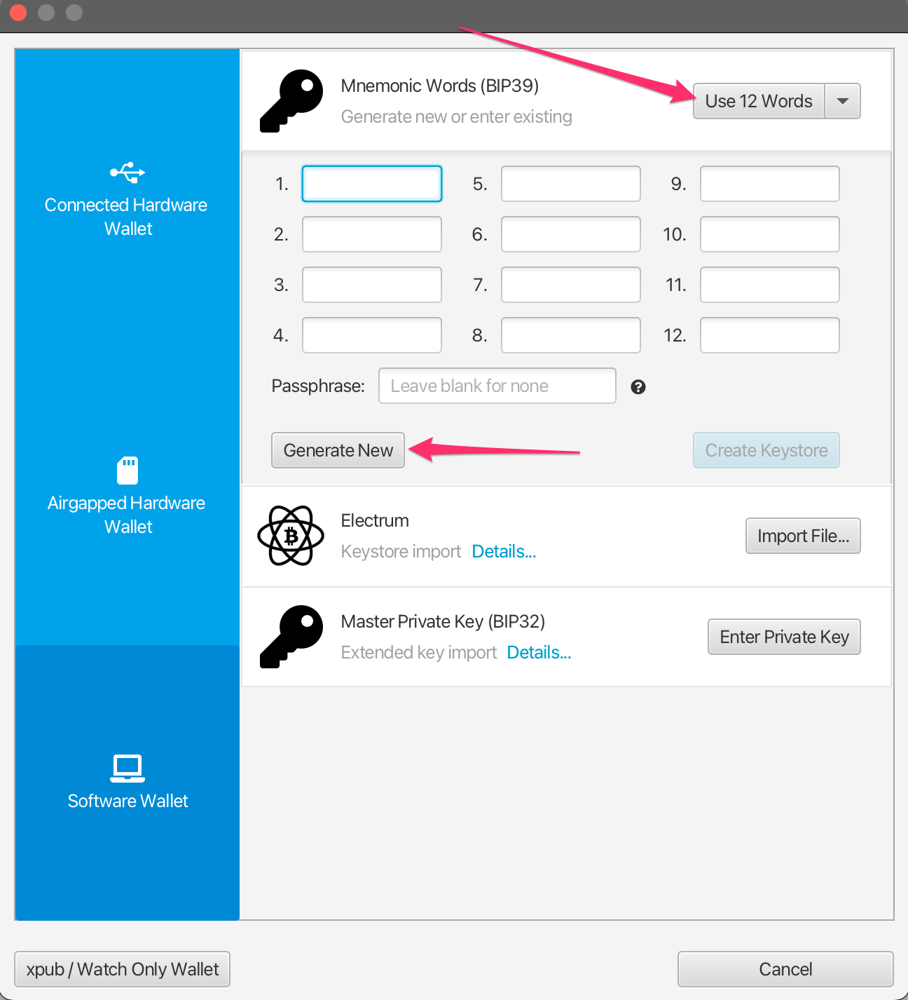
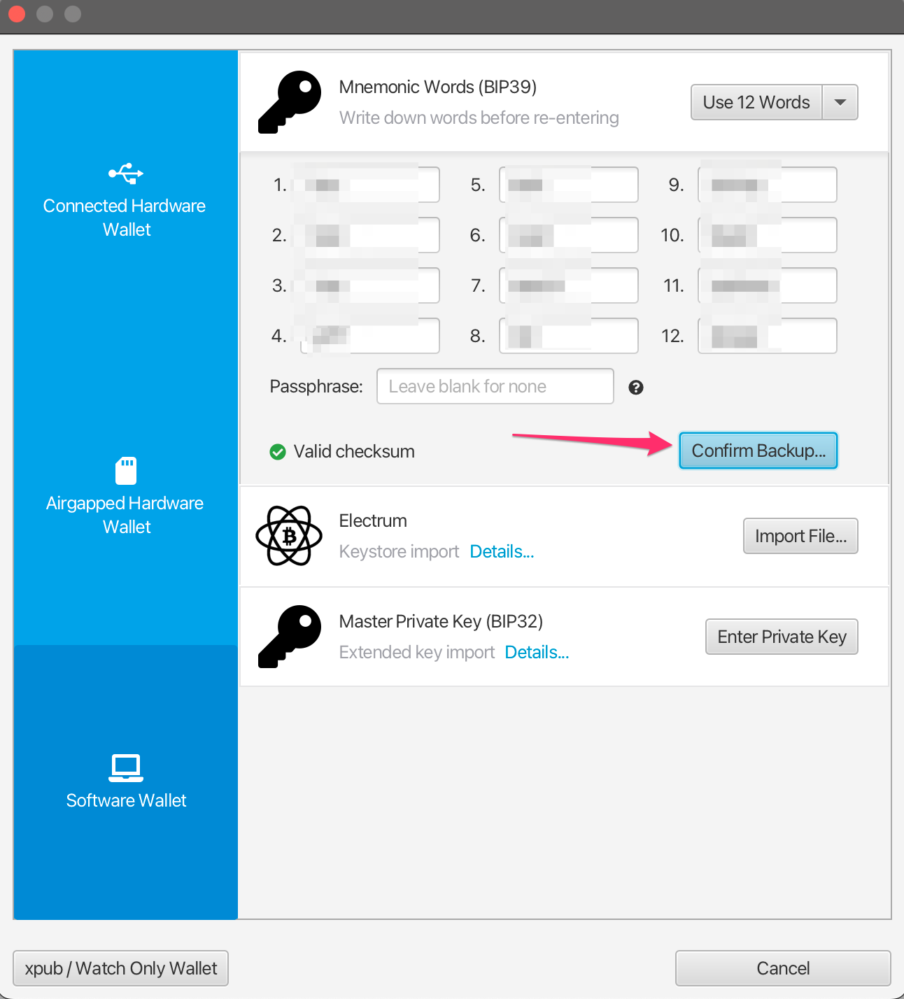
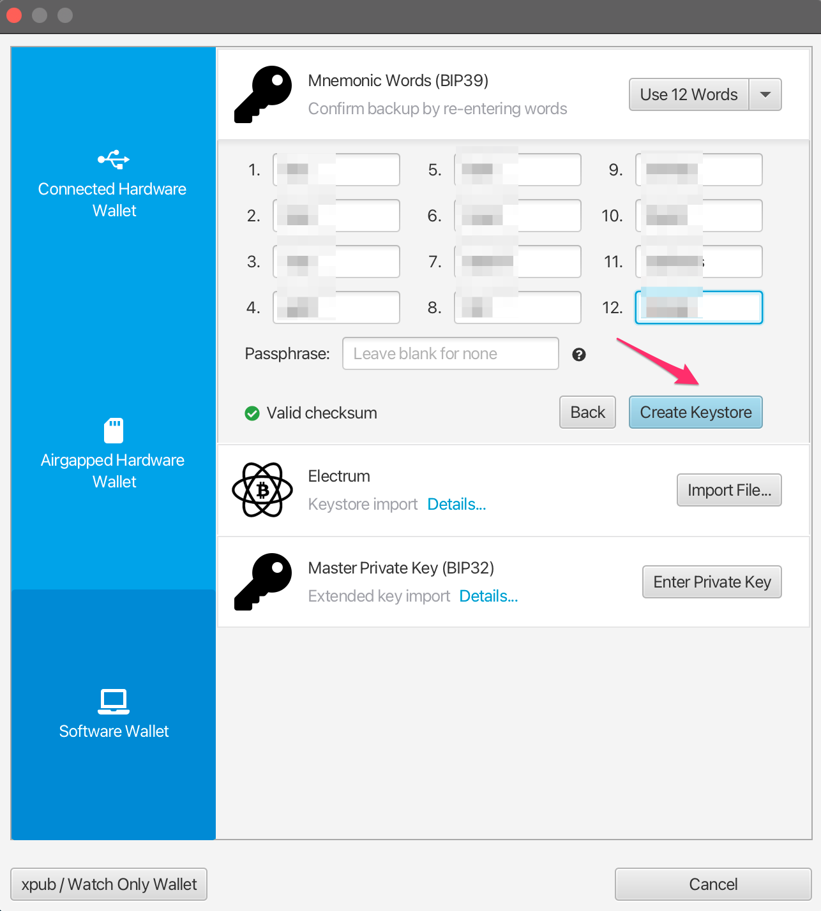
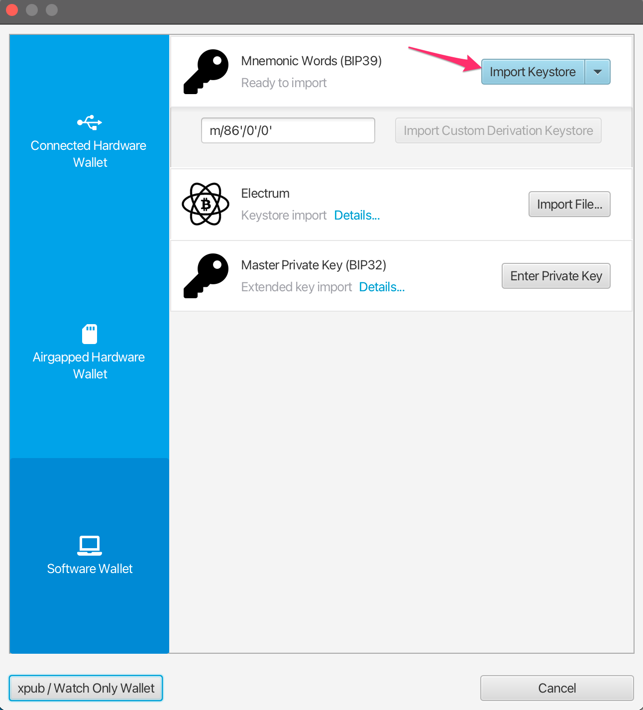
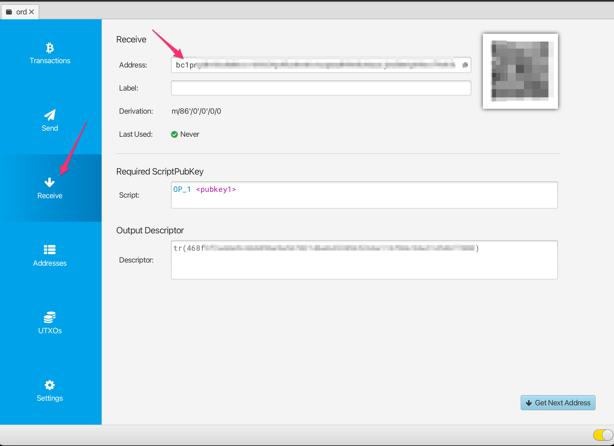
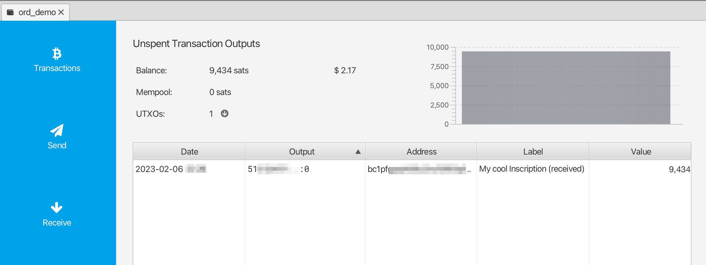
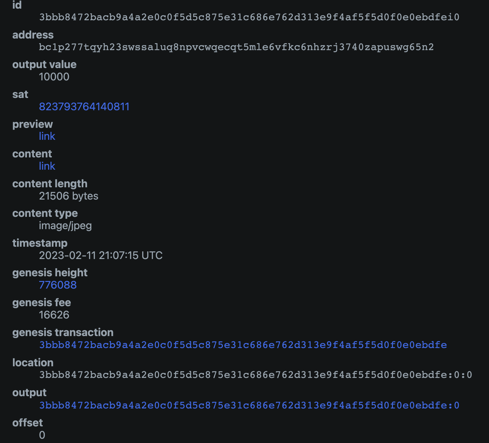
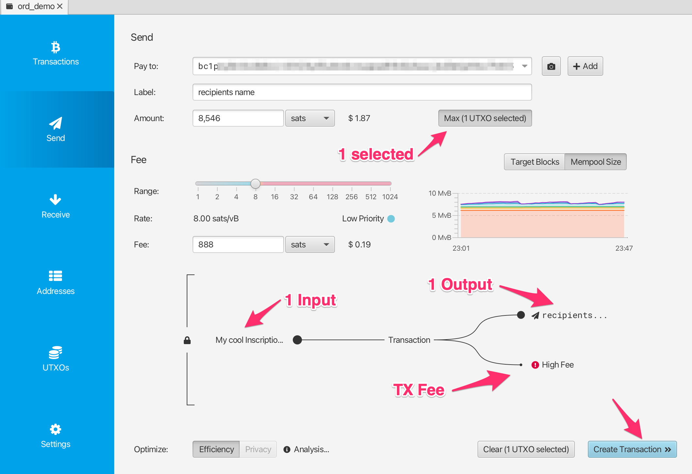
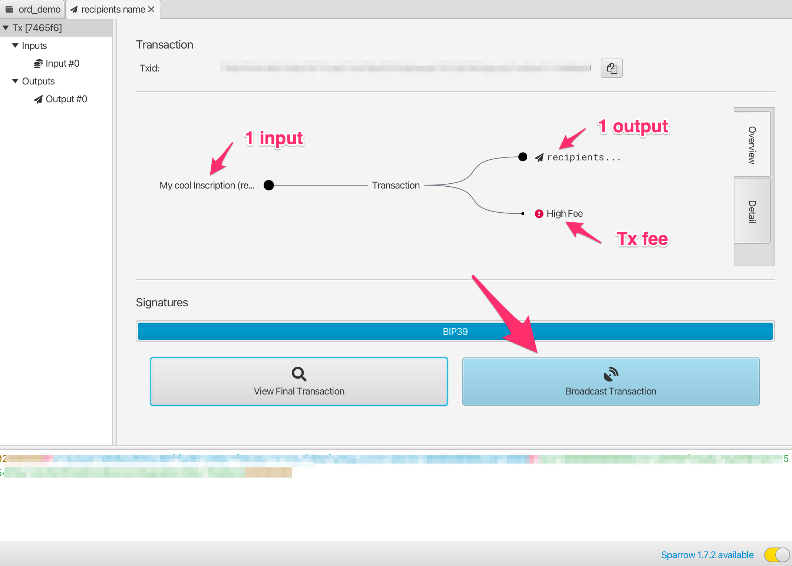
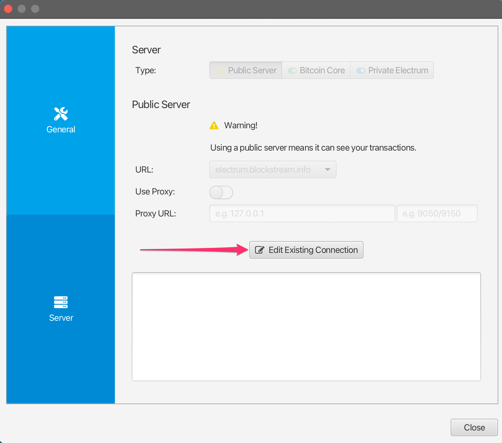

Collecting Inscriptions and Ordinals with Sparrow Wallet
=====================

Users who cannot or have not yet set up the [ord](https://github.com/ordinals/ord) wallet can receive inscriptions and ordinals with alternative bitcoin wallets, as long as they are _very_ careful about how they spend from that wallet.

This guide gives some basic steps on how to create a wallet with [Sparrow Wallet](https://sparrowwallet.com/) which is compatible with `ord` and can be later imported into `ord`

## ⚠️⚠️ Warning!! ⚠️⚠️
As a general rule if you take this approach, you should use this wallet with the Sparrow software as a receive-only wallet.

Do not spend any satoshis from this wallet unless you are sure you know what you are doing. You could very easily inadvertently lose access to your ordinals and inscriptions if you don't heed this warning.

## Wallet Setup & Receiving

Download the Sparrow Wallet from the [releases page](https://sparrowwallet.com/download/) for your particular operating system.

Select `File -> New Wallet` and create a new wallet called `ord`.

Change the `Script Type` to `Taproot (P2TR)` and select the `New or Imported Software Wallet` option.

Select `Use 12 Words` and then click `Generate New`. Leave the passphrase blank.

A new 12 word BIP39 seed phrase will be generated for you. Write this down somewhere safe as this is your backup to get access to your wallet. NEVER share or show this seed phrase to anyone else.

Once you have written down the seed phrase click `Confirm Backup`.

Re-enter the seed phrase which you wrote down, and then click `Create Keystore`.

Click `Import Keystore`.

Click `Apply`. Add a password for the wallet if you want to.

You now have a wallet which is compatible with `ord`, and can be imported into `ord` using the BIP39 Seed Phrase. To receive ordinals or inscriptions, click on the `Receive` tab and copy a new address.

Each time you want to receive you should use a brand-new address, and not re-use existing addresses.

Note that bitcoin is different to some other blockchain wallets, in that this wallet can generate an unlimited number of new addresses. You can generate a new address by clicking on the `Get Next Address` button. You can see all of your addresses in the `Addresses` tab of the app.

You can add a label to each address, so you can keep track of what it was used for.

## Validating / Viewing Received Inscriptions

Once you have received an inscription you will see a new transaction in the `Transactions` tab of Sparrow, as well as a new UTXO in the `UTXOs` tab.

Initially this transaction may have an "Unconfirmed" status, and you will need to wait for it to be mined into a bitcoin block before it is fully received.

To track the status of your transaction you can right-click on it,  select `Copy Transaction ID` and then paste that transaction id into [mempool.space](https://mempool.space).

Once the transaction has confirmed, you can validate and view your inscription by heading over to the `UTXOs` tab, finding the UTXO you want to check, right-clicking on the `Output` and selecting `Copy Transaction Output`. This transaction output id can then be pasted into the [ordinals.com](https://ordinals.com) search.

## Freezing UTXO's
As explained above, each of your inscriptions is stored in an Unspent Transaction Output (UTXO). You want to be very careful not to accidentally spend your inscriptions, and one way to make it harder for this to happen is to freeze the UTXO.

To do this, go to the `UTXOs` tab, find the UTXO you want to freeze, right-click on the `Output` and select `Freeze UTXO`.

This UTXO (Inscription) is now un-spendable within the Sparrow Wallet until you unfreeze it.

## Importing into `ord` wallet

For details on setting up Bitcoin Core and the `ord` wallet check out the [Inscriptions Guide](../inscriptions.md)

When setting up `ord`, instead of running `ord wallet create` to create a brand-new wallet, you can import your existing wallet using `ord wallet restore "BIP39 SEED PHRASE"` using the seed phrase you generated with Sparrow Wallet.

There is currently a [bug](https://github.com/ordinals/ord/issues/1589) which causes an imported wallet to not be automatically rescanned against the blockchain. To work around this you will need to manually trigger a rescan using the bitcoin core cli:
`bitcoin-cli -rpcwallet=ord rescanblockchain 767430`

You can then check your wallet's inscriptions using `ord wallet inscriptions`

Note that if you have previously created a wallet with `ord`, then you will already have a wallet with the default name, and will need to give your imported wallet a different name. You can use the `--wallet` parameter in all `ord` commands to reference a different wallet, eg:

`ord --wallet ord_from_sparrow wallet restore "BIP39 SEED PHRASE"`

`ord --wallet ord_from_sparrow wallet inscriptions`

`bitcoin-cli -rpcwallet=ord_from_sparrow rescanblockchain 767430`

## Sending inscriptions with Sparrow Wallet

#### ⚠️⚠️ Warning ⚠️⚠️
While it is highly recommended that you set up a bitcoin core node and run the `ord` software, there are certain limited ways you can send inscriptions out of Sparrow Wallet in a safe way. Please note that this is not recommended, and you should only do this if you fully understand what you are doing.

Using the `ord` software will remove much of the complexity we are describing here, as it is able to automatically and safely handle sending inscriptions in an easy way.

#### ⚠️⚠️ Additional Warning ⚠️⚠️
Don't use your sparrow inscriptions wallet to do general sends of non-inscription bitcoin. You can setup a separate wallet in sparrow if you need to do normal bitcoin transactions, and keep your inscriptions wallet separate.

#### Bitcoin's UTXO model
Before sending any transaction it's important that you have a good mental model for bitcoin's Unspent Transaction Output (UTXO) system. The way Bitcoin works is fundamentally different to many other blockchains such as Ethereum. In Ethereum generally you have a single address in which you store ETH, and you cannot differentiate between any of the ETH -  it is just all a single value of the total amount in that address. Bitcoin works very differently in that we generate a new address in the wallet for each receive, and every time you receive sats to an address in your wallet you are creating a new UTXO. Each UTXO can be seen and managed individually. You can select specific UTXO's which you want to spend, and you can choose not to spend certain UTXO's.

Some Bitcoin wallets do not expose this level of detail, and they just show you a single summed up value of all the bitcoin in your wallet. However, when sending inscriptions it is important that you use a wallet like Sparrow which allows for UTXO control.

#### Inspecting your inscription before sending
Like we have previously described inscriptions are inscribed onto sats, and sats are stored within UTXOs. UTXO's are a collection of satoshis with some particular value of the number of satoshis (the output value). Usually (but not always) the inscription will be inscribed on the first satoshi in the UTXO.

When inspecting your inscription before sending the main thing you will want to check is which satoshi in the UTXO your inscription is inscribed on.

To do this, you can follow the [Validating / Viewing Received Inscriptions](./sparrow-wallet.md#validating--viewing-received-inscriptions) described above to find the inscription page for your inscription on ordinals.com

There you will find some metadata about your inscription which looks like the following:

There is a few of important things to check here:
* The `output` identifier matches the identifier of the UTXO you are going to send
* The `offset` of the inscription is `0` (this means that the inscription is located on the first sat in the UTXO)
* the `output_value` has enough sats to cover the transaction fee (postage) for sending the transaction. The exact amount you will need depends on the fee rate you will select for the transaction

If all of the above are true for your inscription, it should be safe for you to send it using the method below.

⚠️⚠️ Be very careful sending your inscription particularly if the `offset` value is not `0`. It is not recommended to use this method if that is the case, as doing so you could accidentally send your inscription to a bitcoin miner unless you know what you are doing.

#### Sending your inscription
To send an inscription navigate to the `UTXOs` tab, and find the UTXO which you previously validated contains your inscription.

If you previously froze the UXTO you will need to right-click on it and unfreeze it.

Select the UTXO you want to send, and ensure that is the _only_ UTXO is selected. You should see `UTXOs 1/1` in the interface. Once you are sure this is the case you can hit `Send Selected`.

You will then be presented with the transaction construction interface. There is a few things you need to check here to make sure that this is a safe send:

* The transaction should have only 1 input, and this should be the UTXO with the label you want to send
* The transaction should have only 1 output, which is the address/label where you want to send the inscription

If your transaction looks any different, for example you have multiple inputs, or multiple outputs then this may not be a safe transfer of your inscription, and you should abandon sending until you understand more, or can import into the `ord` wallet.

You should set an appropriate transaction fee, Sparrow will usually recommend a reasonable one, but you can also check [mempool.space](https://mempool.space) to see what the recommended fee rate is for sending a transaction.

You should add a label for the recipient address, a label like `alice address for inscription #123` would be ideal.

Once you have checked the transaction is a safe transaction using the checks above, and you are confident to send it you can click `Create Transaction`.

Here again you can double check that your transaction looks safe, and once you are confident you can click `Finalize Transaction for Signing`.

Here you can triple check everything before hitting `Sign`.

And then actually you get very very last chance to check everything before hitting `Broadcast Transaction`. Once you broadcast the transaction it is sent to the bitcoin network, and starts being propagated into the mempool.

If you want to track the status of your transaction you can copy the `Transaction Id (Txid)` and paste that into [mempool.space](https://mempool.space)

Once the transaction has confirmed you can check the inscription page on [ordinals.com](https://ordinals.com) to validate that it has moved to the new output location and address.

## Troubleshooting

#### Sparrow wallet is not showing a transaction/UTXO, but I can see it on mempool.space!

Make sure that your wallet is connected to a bitcoin node. To validate this, head into the `Preferences`-> `Server` settings, and click `Edit Existing Connection`.

From there you can select a node and click `Test Connection` to validate that Sparrow is able to connect successfully.

